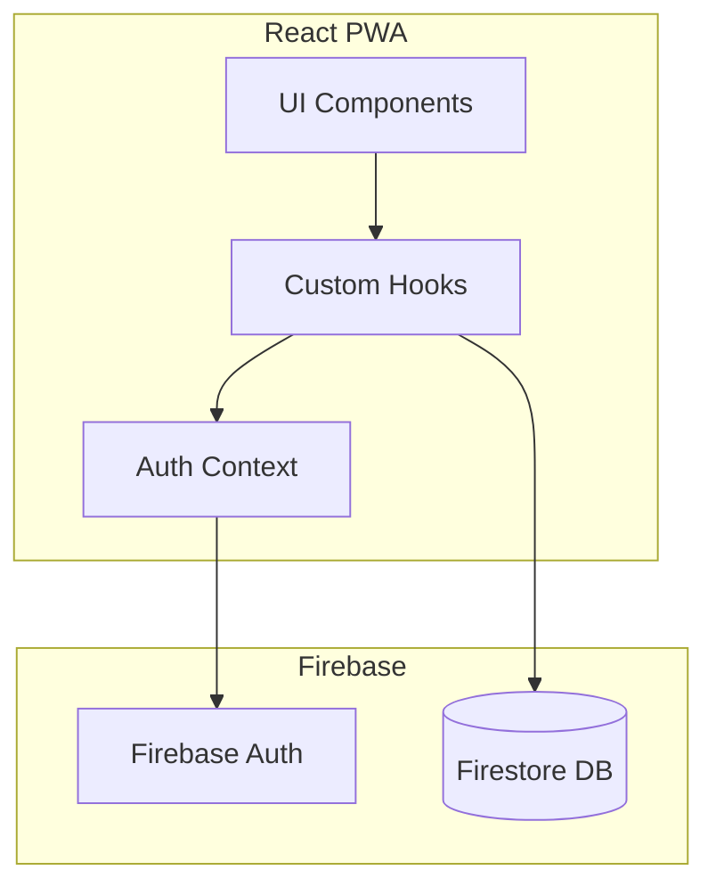
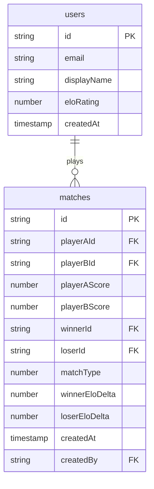
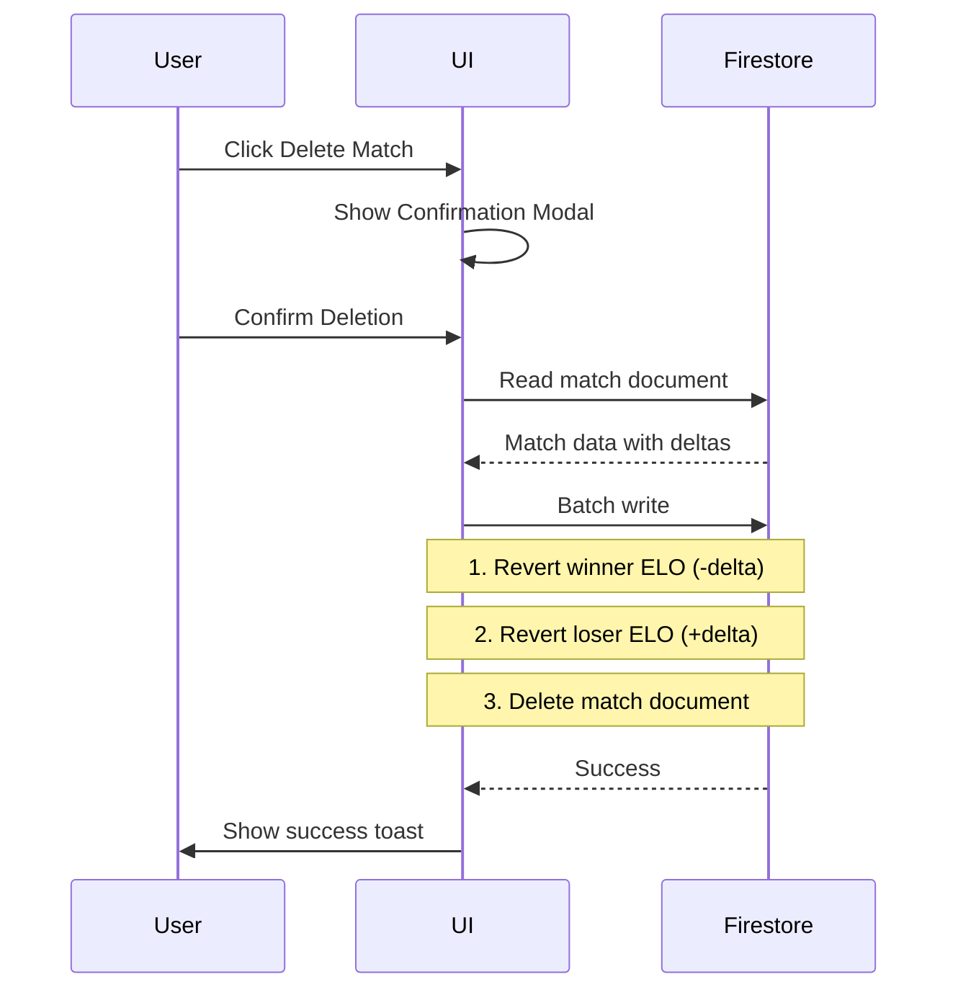

# Ping Pong Tracker PWA

## Tech Stack

- **Frontend**: React 18 + TypeScript + Vite
- **Backend**: Firebase (Firestore + Auth)
- **Styling**: Tailwind CSS (mobile-first)
- **PWA**: vite-plugin-pwa (Workbox)
- **Routing**: React Router v6

## Architecture Overview




## Data Model (Firestore Collections)



**Key Design Decisions:**

- ELO deltas stored per match for accurate rollback on deletion
- Stats derived dynamically from match history (no denormalization)
- `createdBy` tracks who logged the match for accountability

## Project Structure

```javascript
src/
├── components/
│   ├── layout/        # Navigation, Layout wrapper
│   ├── auth/          # Login, Register forms
│   ├── match/         # MatchForm, MatchCard, MatchList
│   ├── leaderboard/   # LeaderboardTable, RankChange
│   ├── profile/       # PlayerStats, OpponentBreakdown
│   └── ui/            # Button, Card, Input, Modal
├── hooks/
│   ├── useAuth.ts
│   ├── useMatches.ts
│   ├── usePlayers.ts
│   └── useStats.ts
├── lib/
│   ├── firebase.ts    # Firebase config
│   ├── elo.ts         # ELO calculation logic
│   └── validation.ts  # Match validation rules
├── context/
│   └── AuthContext.tsx
├── pages/
│   ├── Login.tsx
│   ├── Register.tsx
│   ├── Dashboard.tsx
│   ├── Leaderboard.tsx
│   ├── NewMatch.tsx
│   └── Profile.tsx
└── types/
    └── index.ts
```


## Core Implementation Details

### 1. ELO Calculation (`src/lib/elo.ts`)

```typescript
// K-factor determines rating volatility (32 is standard for casual play)
const K = 32;

function calculateElo(winnerRating: number, loserRating: number) {
  const expectedWinner = 1 / (1 + Math.pow(10, (loserRating - winnerRating) / 400));
  const expectedLoser = 1 - expectedWinner;
  
  const winnerDelta = Math.round(K * (1 - expectedWinner));
  const loserDelta = Math.round(K * (0 - expectedLoser));
  
  return { winnerDelta, loserDelta };
}
```


### 2. Match Validation Rules

- Winner score must equal matchType (11 or 21)
- Loser score must be less than winner score
- If loser has 10 (or 20), winner must have 12 (or 22) - deuce rule
- Players cannot be the same person
- Duplicate detection: block if identical match within 1 minute

### 3. Match Deletion Flow




### 4. PWA Configuration

- `manifest.json` with app name, icons (192x192, 512x512), theme colors
- Service worker for app shell caching
- iOS meta tags for Add to Home Screen support

## UI/UX Design

### Navigation (Bottom Tab Bar)

- **Leaderboard** - Rankings with ELO and arrows
- **New Match** - Quick match entry form
- **Profile** - Personal stats and history

### Color Palette

- Primary: Deep blue (#1e3a5f)
- Accent: Vibrant orange (#f97316)
- Success: Green (#22c55e) for wins
- Error: Red (#ef4444) for losses
- Background: Slate gray (#0f172a)

### Key UI Components

- **LeaderboardTable**: Rank position, player name, ELO, W/L, change indicator (up/down arrows)
- **MatchCard**: Compact display of score, opponent, date, ELO delta
- **PlayerSelect**: Dropdown with player avatars
- **StatsGrid**: Cards showing total games, win rate, current streak

## Files to Create

| File | Purpose |

|------|---------|

| `package.json` | Dependencies and scripts |

| `vite.config.ts` | Vite + PWA plugin config |

| `tailwind.config.js` | Tailwind with custom theme |

| `public/manifest.json` | PWA manifest |

| `src/lib/firebase.ts` | Firebase initialization |

| `src/lib/elo.ts` | ELO calculation with comments |

| `src/lib/seed.ts` | Mock data for testing |

| `src/context/AuthContext.tsx` | Auth state management |

| `src/pages/*.tsx` | 6 page components |

| `src/components/**/*.tsx` | Reusable UI components |

| `src/hooks/*.ts` | 4 custom hooks for data fetching |

| `index.html` | Entry with iOS PWA meta tags |

## Firebase Setup Notes

- Create Firebase project at console.firebase.google.com
- Enable Email/Password authentication
- Create Firestore database in test mode initially
- Add security rules to restrict access to authenticated users
- Environment variables for Firebase config in `.env`

## Mock/Seed Data

Will include a seed script that creates:

- 5 test players with varying ELO ratings
- 15-20 sample matches with realistic scores